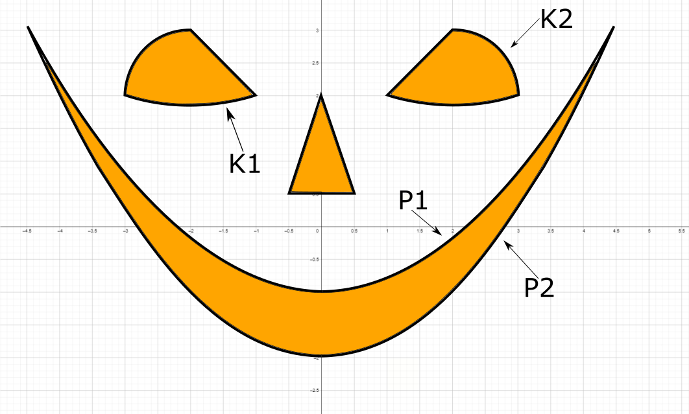

# Домашна работа 1 - група 1

## Задача 1

Дадени са ви елементите на целочислен масив **arr**, техния брой **n** и начален индекс **i**. Реализирайте следния алгоритъм:

Проверете по четност числото на текущия индекс i.
* Ако елемента е четен текущия индекс става i - arr[i]%5
* Ако елемента е нечетен текущия индекс става i + 3

Повторете алгоритъма ако текущия индекс е в границите на масива. Да се изпише на екрана броя на стъпките след, които се излиза от него. Да се изпише подходящо съобщение ако се достигне до безкрайно въртене в масива и да се изпише след колко стъпки се достига то.

Първо ще се подаде броя на елементите в масива , след това ще бъдат изброени с разстояния елементите и накрая ще бъде подаден индекса, от който да започнете.

```
Пример 1:
  Вход: 
    7
    9 6 7 6 5 14 2
    3
  Изход:
    A loop is encountered after 5 steps!
```
```
Пример 2:
  Вход: 
    6
    6 11 22 15 12 14
    5
  Изход:
    After 5 steps we are out of the array!
```

## Задача 2

Подадени са ви две целочислени числа **a** и **b**. Да се реализира метода на Евклид за най-голям общ делител **d**.


**Алгоритъм на Евклид:**

Нека **a** и **b** са две положителни цели числа. Нека **a** да е по-голямото от двете числа. Тогава можем да представим **а** по следния начин:

 

където  е остатъка от делението на **a** по модул от **b**, a  е цялата част от целочисленото деление.

Ако  то НОД, в противен случай повтаряме процеса като новите **a** и **b** са респективно **b** и  т.е

 
и повтаряме алгоритъма от начало.

Пример за числата 78 и 46:


<br><br>

<br>

<br>

<br>

<br>

<br>
C:\Users\DevilPenta\Documents\ShareX\Screenshots\2020-10\chrome_5EmJpeuSTG.png

## Бонус задача



По подадена точка от декартовата равнина проверете дали тя попада в някоя от областите оцветени в оранжево, където:

* К1 е окръжност с център (-2, 5) и радиус 
* К2 е окръжност с център (2, 2) и радиус 1
* P1 е параболата 
* P2 е параболата 