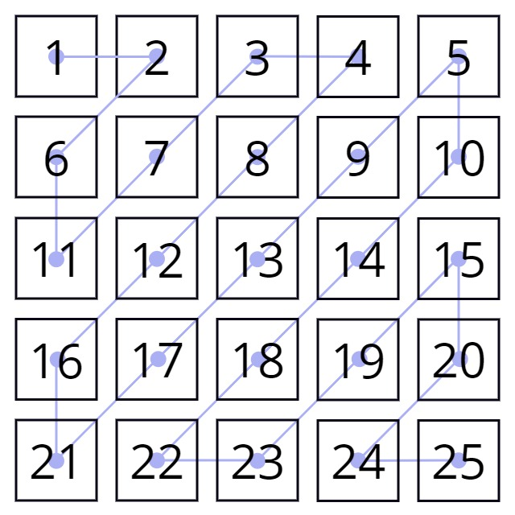

# Домашна работа 2

## Задача 1
Даден ви е размера **n** (*3< **n** < 10*) на квадратна матрица и нейните елементи. Да се напише програма, която изкарва на екрана елементите на матрицата по диагоналите зигзагообразно, както е показано на картинката.

 

 Изход: 1 2 6 11 7 3 4 8 12 16 21 17 13 9 5 10 14 18 22 23 19 15 20 24 25


 ## Задача 2
В следната задача масива, който се подава е от реални стойности и е едномерен, а размера му е между 5 и 1000

 Да се напишат следните функции:
 - функция за въвеждане на масив
 - функция за извеждане на масив
 - функция, която да намира медианата от стойностите на масив
 - функция, която да намира модата от стойностите на масива

## Задача 3

Да се напише функция, която по подаден масив от цели числа, неговия размер в интервала [5, 100], и две цели стойности **a** и **b**, където **a<b**, да се изпълнява следното:
- Да се сортира низа в низходящ ред
- Да се премахнат повтарящите се елементи
- Да се премахнат елементите със стойности извън интервала **(a,b)**

Преценете как бихте разбили задачата на отделни подзадачки и ги реализирайте в отделни функции, където исканата от вас функция да изпълнява. Резултатния масив да се изпише на екрана и колко елементи има.

```
Пример:
Вход:
10                       //броя наелементи в масива
6 5 5 9 5 21 -1 15 8 6   //елементите
3 14                     //стойностите на a и b

Изход:
4 елемента
9 8 6 5
```


 ## Бонус

 Тъй като ние няма да можем да стигнем до низове на практикум,  когато домашното ви е пуснато, но вече ще сте стигнали на лекции и семинар, то задачката с низа я даваме като бонус за хората, които искат да се упражнят предварително. Символните низове, които ще ползваме, ще са от библиотеката string, а не обикновените символни масиви с терминираща нула накрая (но ако някой иска с тях да работи по задачата няма проблем). 

 Да се напише функция, която по подадени два символни низа str и sub_str, да върне индекса на началото на последното срещане на подниза sub_str в низа str, без да използвате вградени функции. Ако поднизът не се среща да връща -1.

```
Пример 1:
Вход: 
    str : The quick brown fox jumped over the lazy dog!
    sub_str : fox
Изход: 
    16

Пример 2:
Вход: 
    str : dog cat cat dog
    sub_str : dog
Изход: 
    12

Пример 3:
Вход: 
    str : Lorem ipsum dolor sit amed...
    sub_str : dog
Изход: 
    -1
```
