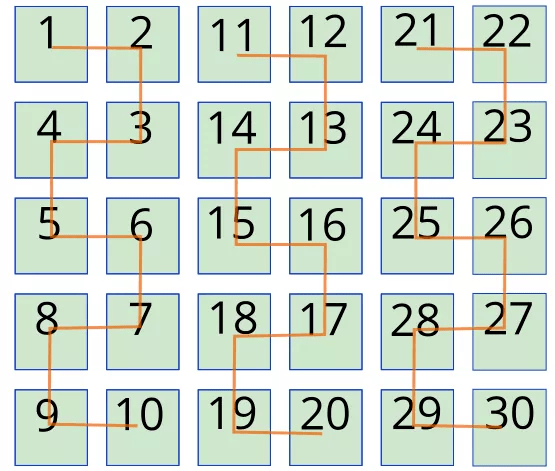

# Домашна работа 2

## Задача 1
Нека матрица има **n** на брой реда (нечетно число) и **n+1** стълба.
Обходете матрицата както е показано отдолу:



 ## Задача 2
 Създайте функция, която да запълва масив с **различни** числа.
 
 - Въвеждането трябва да не спира, докато не се запълни целия масив. Ако подадете повтарящо се число, то да не се записва.
 
 - Масивът трябва да се сортира във възходящ ред, **докато се въвеждат числата**. Първо намирате къде трябва да седи числoто и след това го слагате на това място.
 
 ```
 Пример: 
 
 Последовтелно въвеждане на числата: 1, 3, 5, 4, 1, 6, 6, 8.
 
 Изход: 1, 3, 4, 5, 6, 8
 ```
 
 ## Задача 3
 
 При подаден символен низ, да се провери дали той е палиндром (интервалите не влизат в проверката).

```
Вход: race car
Изхо: It's a palindrome

Вход: some words
Изход: Not a palindrome
```

## Бонус задача
Фукнкцията на Ойлер phi(n), където n е естествено число, показва колко числа по-малки от n са взаимнопрости с него.

- phi(2)=1.

- phi(6)=2.

- phi(**p**)=**p**-1 (за **p** просто число).

Ако две числа **а** и **b**  са взаимнопрости, то phi(**a**\***b**)=phi(**a**)\*phi(**b**).

Ако пък **p** е просто, a **а** естствено, то phi(**p**^(**a**))=**p**^(**a**)-**p**^(**a**-1)

Използвайки тези зависимости, създайте функция, която имплементира функцията на Ойлер за произволно естествено число **n**.

```
Вход: 45
Изход: 24

Вход: 24
Изход: 8
```
