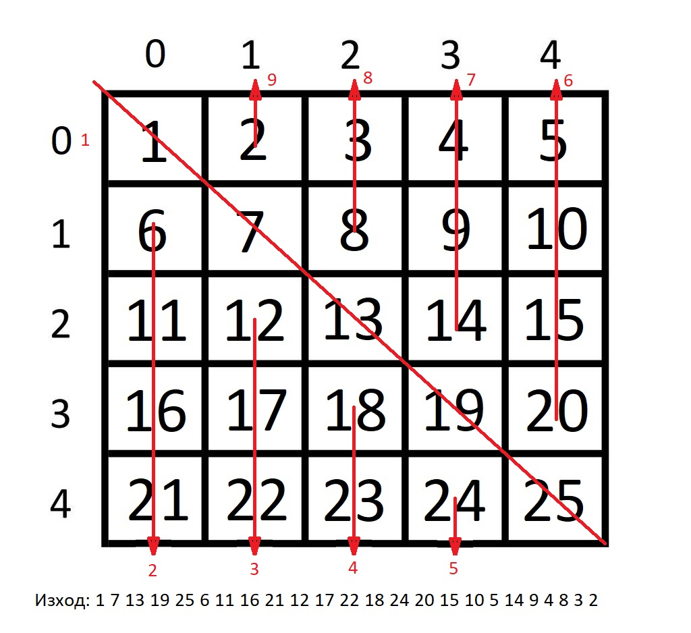
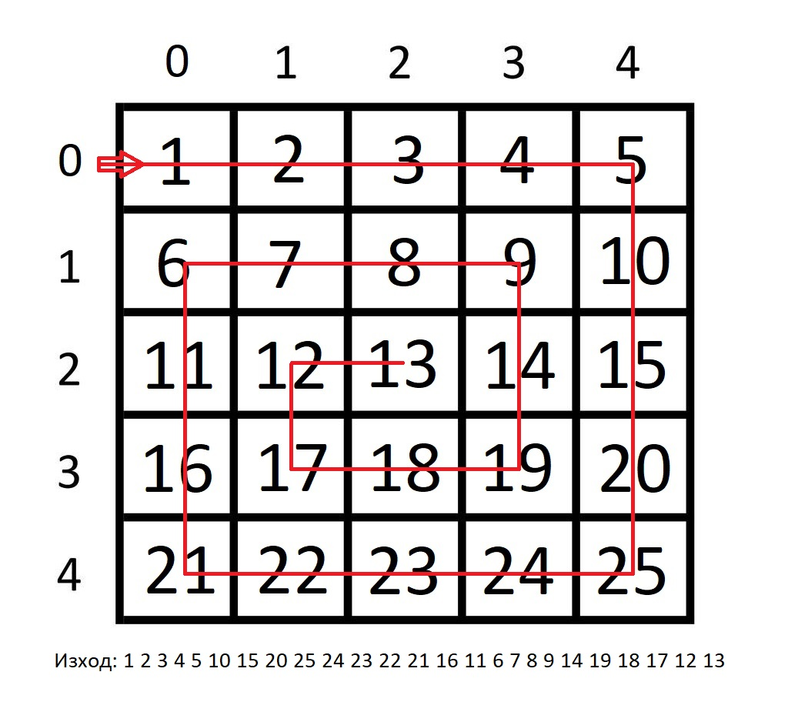

# Упражнение 5

## Задача 1

Обходете матрицата диагонално и изкарайте числата в съответния ред, както е показано отдолу:


## Задача 2

Да се обходи двумерния масив и да се изпишат елементите му в следната последоватеност:

* Първо главният диагонал (отляво надясно)
* След това колоните под главния диагонал (отляво надясно). Елементите от всяка колона отдолу нагоре.
* Накрая колоните над главния диагонал (отдясно на наляво). Елементите в колоните да се обходят отдолу нагоре.



## Задача 3

Да се обходи матрицата спираловдно, както е показано по-долу




## Задача 4
Нека имаме булева матрица (запълнена само с нули и единици) и, където има единица, редът и колоната на този елемент да се запълнят с единици.

```
Вход:

1 0 0 1
0 0 1 0 
0 0 0 0 

Изход:

1 1 1 1 
1 1 1 1 
1 0 1 1 
```

## Задача 5

Запъленете матрица, така че да придобие вида "пачи крак", и пресметнете детерминантата и.

## Задача 6
Умножете две матрици и изведете резултатната на екрана.
